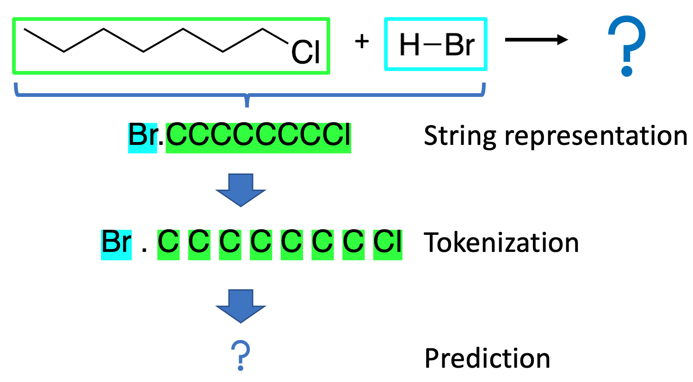
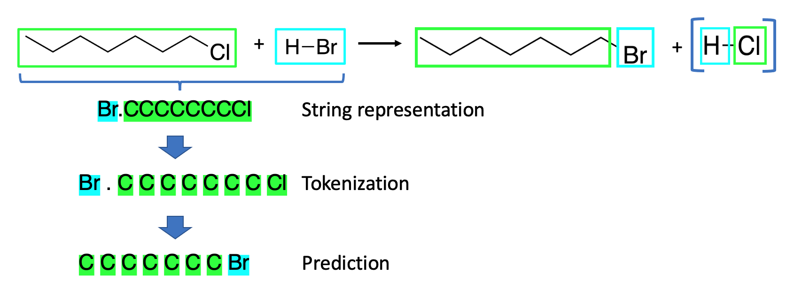

.. These are examples of badges you might want to add to your README:
   please update the URLs accordingly

    .. image:: https://api.cirrus-ci.com/github/<USER>/selfiespredict.svg?branch=main
        :alt: Built Status
        :target: https://cirrus-ci.com/github/<USER>/selfiespredict
    .. image:: https://readthedocs.org/projects/selfiespredict/badge/?version=latest
        :alt: ReadTheDocs
        :target: https://selfiespredict.readthedocs.io/en/stable/
    .. image:: https://img.shields.io/coveralls/github/<USER>/selfiespredict/main.svg
        :alt: Coveralls
        :target: https://coveralls.io/r/<USER>/selfiespredict
    .. image:: https://img.shields.io/pypi/v/selfiespredict.svg
        :alt: PyPI-Server
        :target: https://pypi.org/project/selfiespredict/
    .. image:: https://img.shields.io/conda/vn/conda-forge/selfiespredict.svg
        :alt: Conda-Forge
        :target: https://anaconda.org/conda-forge/selfiespredict
    .. image:: https://pepy.tech/badge/selfiespredict/month
        :alt: Monthly Downloads
        :target: https://pepy.tech/project/selfiespredict
    .. image:: https://img.shields.io/twitter/url/http/shields.io.svg?style=social&label=Twitter
        :alt: Twitter
        :target: https://twitter.com/selfiespredict
      .. image:: https://img.shields.io/badge/-PyScaffold-005CA0?logo=pyscaffold
          :alt: Project generated with PyScaffold
          :target: https://pyscaffold.org/

|

==============
SelfiesPredict
==============

    Reaction outcome prediction using SELFIES 

This Repository containes our work for the project 2 of the EPFL course CS433 in machinelearning.
We carried this project out as part of the ML4Science initiative, that allows students to join a research lab and work on a practical ML problem.
This problem was kindly provided by `Philippe Schwaller <https://pschwllr.github.io/#>`_ who also advised us over the course of the project.

In this work, we have retrained a transformer based model for chemical reaction prediction using string-based molecular representations.
We compaire the established SMILES representation with the recently developped `SELFIES <https://github.com/aspuru-guzik-group/selfies>`_ representation, that performs well in generative models.

In transformer based chemical reaction prediction, the prediction problem is treated as a NLP translation task, where the input or educts are treated as the language that is to be translated, and the reaction products are the desired translations.

Repository structure
====================

The repository is structured into subdirectories containing raw data utilised for training models :code:`/raw_data`, all pretrained models mentioned in the report :code:`/pretrained_models`, reactant translation results on the validation set :code:`/results`, config files for onmt models :code:`/run`, utilised functions :code:`/src/selfiespredict`. A example notebook for generating data, training a model and evaluating predictions is included at the root :code:`Tokenize_Train_Evaluate.ipynb`. The report and figures are included in :code:`/report`.

Not all data utilised in the report is included due to size limitations. Tokenized SMILES data is included in :code:`/tokenized_data`. All other data may be generated by functions in :code:`/src/selfiespredict/data`.

Functions
====================

Functions are split into data (:code:`/src/selfiespredict/data`), evaluation (:code:`/src/selfiespredict/evaluation`) and helpers (:code:`/src/selfiespredict/helpers`). The data_load file in :code:`/src/selfiespredict/data` contains the data_loader class for downloading raw data (:code:`import_data`) and generating the tokenized data we used for our models (:code:`gen_txt` / :code:`gen_SMILE_tokenized_SELFIES` /  :code:`gen_SELFIEandSMILES`). It also includes functions for converting the string representations into eachother and for tokenization. The :code:`errormetrics` file in :code:`/src/selfiespredict/helpers` yields the top1 or top5 accuracy used for evaluating the models. The :code:`Helper_Functions` file in :code:`/src/selfiespredict/helpers` contains the SMILES tokenizer.

Example
=======

* The reaction prediction problem that was introduced in the report (fig.1) can be solved with the pretrained SMILES model that we have included in the repository::

     onmt_translate -model ./pretrained_models/SMILES_250K_pretrained.pt \ 
     --src ./data/tokenized_data/SMILES/USPTO_480k/src-val.txt \
     --output predicted_reaction_outcome.txt \ 
     --n_best 1 --beam_size 5 --max_length 3000 --batch_size 100

* The predicted outcome confirms what a trained chemist can derive: The educts have undergone a nucleophilic substitution reaction.
  The by- product of the reaction, hydrochloric acid (H-Cl), is not predicted by the model as it only is trained on predicting the main product. 

Install notes
=============

* We recommend first creating a virtual environment::
     
     conda create --name selfies_project
     conda activate selfies_project

* The code can be installed by first cloning the repository and then running pip locally::

     git clone <link>
     cd <./cloned_repository>
     pip install . --user
     
* On Windows, the rdkit wheel might not work and git/setuptools might not be installed, for that we recommend the recommended rdkit-install::
     
     conda activate selfies_project
     #make sure to uninstall the not-working pypi wheel
     pip uninstall rdkit-pypi
     conda install -c rdkit rdkit

* And then install into the environment::
        
        pip install . --user        
  
* It might be possible that the setup file has to be run seperately. Due to the limited time of the project, we were not able to identify why this is nescessary on google colab::

        python setup.py install

.. _pyscaffold-notes:

Tests
====
* To run the tests, run in the selfies directory. This may take a while::

   python -m unittest

